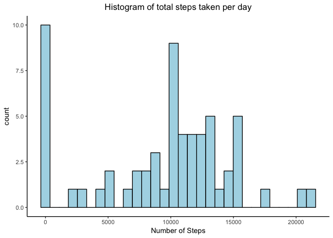
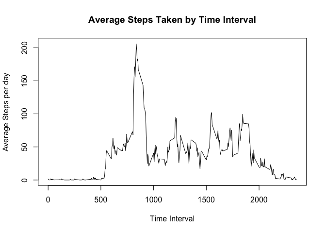
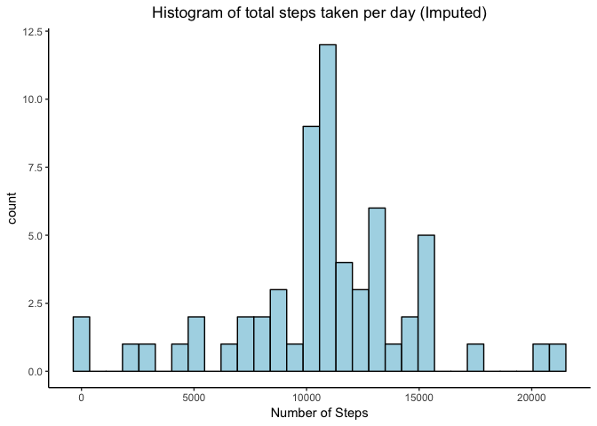
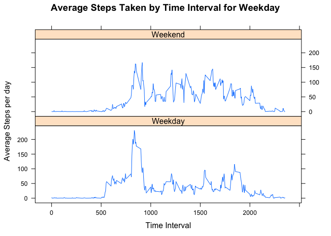

## Setting the woking directory

```r
setwd("/Users/manavsehgal/Library/Mobile Documents/com~apple~CloudDocs/Work/Study/Coursera/Data-Scientist/datasciencecoursera/RepData_PeerAssessment1")
```

##Load the libraries

```r
library(dplyr)
```

```
## 
## Attaching package: 'dplyr'
```

```
## The following objects are masked from 'package:stats':
## 
##     filter, lag
```

```
## The following objects are masked from 'package:base':
## 
##     intersect, setdiff, setequal, union
```

```r
library(ggplot2)
library(lattice) 
```

## Loading and preprocessing the data

```r
#Specify filename
file<-"activity.csv"

#Read the file
data<-read.csv(file)

#show summary of the data
summary(data)
```

```
##      steps                date          interval     
##  Min.   :  0.00   2012-10-01:  288   Min.   :   0.0  
##  1st Qu.:  0.00   2012-10-02:  288   1st Qu.: 588.8  
##  Median :  0.00   2012-10-03:  288   Median :1177.5  
##  Mean   : 37.38   2012-10-04:  288   Mean   :1177.5  
##  3rd Qu.: 12.00   2012-10-05:  288   3rd Qu.:1766.2  
##  Max.   :806.00   2012-10-06:  288   Max.   :2355.0  
##  NA's   :2304     (Other)   :15840
```

```r
#Show the head of the data
head(data)
```

```
##   steps       date interval
## 1    NA 2012-10-01        0
## 2    NA 2012-10-01        5
## 3    NA 2012-10-01       10
## 4    NA 2012-10-01       15
## 5    NA 2012-10-01       20
## 6    NA 2012-10-01       25
```


## What is mean total number of steps taken per day?

```r
#Create a new dataset with sum of steps taken per day
data_processed<-data%>% group_by(date)%>%summarize(Total_Steps=sum(steps,na.rm = TRUE))

#Show the head of the processed data
head(data_processed)
```

```
## # A tibble: 6 x 2
##         date Total_Steps
##       <fctr>       <int>
## 1 2012-10-01           0
## 2 2012-10-02         126
## 3 2012-10-03       11352
## 4 2012-10-04       12116
## 5 2012-10-05       13294
## 6 2012-10-06       15420
```

```r
#create a histogram
ggplot(data=data_processed,aes(x=data_processed$Total_Steps))+geom_histogram(color="black",fill="lightblue")+labs(title="Histogram of total steps taken per day",x="Number of Steps")+theme_classic()+theme(plot.title = element_text(hjust = 0.5))
```

```
## `stat_bin()` using `bins = 30`. Pick better value with `binwidth`.
```

<!-- -->

```r
#mean of the steps taken per day
mean(data_processed$Total_Steps)
```

```
## [1] 9354.23
```

```r
#median of the steps taken per day
median(data_processed$Total_Steps)
```

```
## [1] 10395
```


## What is the average daily activity pattern?

```r
#average the days over time intervals
data_processed2<-data%>% group_by(interval)%>%summarize(average_steps=mean(steps,na.rm = TRUE))

#Show the head of the data
head(data_processed2)
```

```
## # A tibble: 6 x 2
##   interval average_steps
##      <int>         <dbl>
## 1        0     1.7169811
## 2        5     0.3396226
## 3       10     0.1320755
## 4       15     0.1509434
## 5       20     0.0754717
## 6       25     2.0943396
```

```r
#create a time series plot
plot(y=data_processed2$average_steps,x=data_processed2$interval,type="l",xlab="Time Interval",ylab="Average Steps per day",main="Average Steps Taken by Time Interval")
```

<!-- -->

```r
#Find the time interval with max number of average steps
max_interval<-data_processed2$interval[which.max(data_processed2$average_steps)]
max_interval
```

```
## [1] 835
```


## Imputing missing values

```r
#Find the total number of missing values
sum(is.na(data$steps))
```

```
## [1] 2304
```

```r
#Impute the missing data - use mean over the days for the time interval
data_impute<-data
for (i in 1:nrow(data_impute)){
        if(is.na(data_impute$steps[i])){
                interval_temp<-data_impute$interval[i]
                data_impute$steps[i]<-mean(data_impute$steps[data_impute$interval==interval_temp],na.rm=TRUE)
        }
}

#Get summary of the new dataset
summary(data_impute)
```

```
##      steps                date          interval     
##  Min.   :  0.00   2012-10-01:  288   Min.   :   0.0  
##  1st Qu.:  0.00   2012-10-02:  288   1st Qu.: 588.8  
##  Median :  0.00   2012-10-03:  288   Median :1177.5  
##  Mean   : 37.38   2012-10-04:  288   Mean   :1177.5  
##  3rd Qu.: 27.00   2012-10-05:  288   3rd Qu.:1766.2  
##  Max.   :806.00   2012-10-06:  288   Max.   :2355.0  
##                   (Other)   :15840
```

```r
#Create new dataset with total steps each day after imputing
data_processed3<-data_impute%>% group_by(date)%>%summarize(Total_Steps=sum(steps,na.rm = TRUE))

#create a histogram
ggplot(data=data_processed3,aes(x=data_processed3$Total_Steps))+geom_histogram(color="black",fill="lightblue")+labs(title="Histogram of total steps taken per day (Imputed)",x="Number of Steps")+theme_classic()+theme(plot.title = element_text(hjust = 0.5))
```

```
## `stat_bin()` using `bins = 30`. Pick better value with `binwidth`.
```

<!-- -->

```r
#mean of the steps taken per day
mean(data_processed3$Total_Steps)
```

```
## [1] 10766.19
```

```r
#median of the steps taken per day
median(data_processed3$Total_Steps)
```

```
## [1] 10766.19
```


## Are there differences in activity patterns between weekdays and weekends?

```r
#create a new dataset and add the daytype column to it
data_processed4<-mutate(data_impute,day_type=ifelse(weekdays(as.Date(data_impute$date)) %in% c("Saturday","Sunday"),"Weekend","Weekday"))
```

```
## Warning in strptime(xx, f <- "%Y-%m-%d", tz = "GMT"): unknown timezone
## 'default/Asia/Kolkata'
```

```r
#Create average steps per day summary
data_processed5<-data_processed4%>% group_by(interval,day_type)%>%summarize(average_steps=mean(steps,na.rm = TRUE))

#Create a Panel Plot
#par(mfrow=c(2,1))

#with(data_processed5[data_processed5$day_type=="Weekend",],plot(x=interval,y=average_steps,type="l",xlab="Time Interval",ylab="Average Steps per day",main="Average Steps Taken by Time Interval for Weekend"))

#with(data_processed5[data_processed5$day_type=="Weekday",],plot(x=interval,y=average_steps,type="l",xlab="Time Interval",ylab="Average Steps per day",main="Average Steps Taken by Time Interval for Weekday"))

with(data_processed5,xyplot(average_steps~interval|day_type,type="l",xlab="Time Interval",ylab="Average Steps per day",main="Average Steps Taken by Time Interval for Weekday",layout=c(1,2)))
```

<!-- -->
